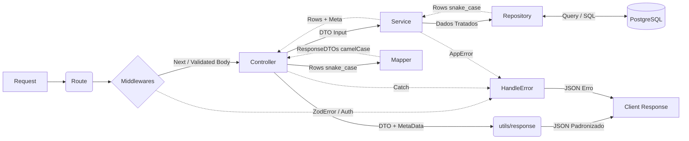

# Backend – Sistema Lassu

## 🛠️ Tecnologias
- Node.js
- TypeScript
- Express
- PostgreSQL
- Zod
- JWT

## 📦 Instalação e Execução

### 1. Acessar a pasta do backend
```bash
cd backend
```
### 2. Instalar dependências
```bash
npm install
```

### 3. Criar um banco de dados no PostgreSQL
```sql
CREATE DATABASE nome_do_banco;
```

### 4. Variáveis de ambiente
Renomeie .env.example para .env e preencha:

```env
PORT=3000
DATABASE_URL=postgres://...
JWT_SECRET=...
```

### 5. Execute o script de inicialização do banco
O projeto possui um arquivo SQL responsável por criar toda a estrutura inicial do banco.

📁 [src/database/init.sql](./database/init.sql)

### 6. Executar o projeto
```bash
npm run dev
```

### 7. Acesso Inicial (Admin)
O script de inicialização do banco (`init.sql`) cria automaticamente uma conta de administrador para que você possa começar a usar o sistema:

* **Email:** `admin@sistema.com`
* **Matrícula:** `0000000`
* **Senha:** `12345678`

> ⚠️ **Importante:** Única forma de criar uma conta admin é por comando sql direto no banco, caso queira um email ou matrícula diferente altere no comando sql, já a senha recomendo manter na execução sql, pois ela é em ``hash``, e trocar dentro da própria aplicação pelo Perfil.

## 🧱 Arquitetura

**O backend segue uma arquitetura em camadas bem definida:**

**Routes** → definição dos endpoints e middlewares da rota.

**Controllers** → ponto de entrada da requisição; orquestra o fluxo, chama o serviço e padroniza a resposta.

**Middlewares** → interceptadores para autenticação, validação de permissões e tratamento de schemas.

**Services** → contém toda a lógica de negócio, regras, validações complexas e **controle de transações (atomicidade)**.

> ⚛️ **Atomicidade e Integridade:**
> Utilizamos o utilitário `withTransaction` nos Services para garantir a atomicidade em operações complexas.
> *Exemplo:* Ao criar um Modelo de Formulário, salvamos a Versão, Seções, Perguntas e Opções em sequência. Se qualquer inserção falhar, o `withTransaction` executa o **rollback** automático de tudo, evitando dados órfãos ou corrompidos no banco.

**Repositories** → camada exclusiva de comunicação direta com o banco de dados (SQL).

**Schemas (Zod)** → validação estrita dos dados de entrada (body, query, params).

**Types** → definições de tipagem TypeScript para tabelas (Rows) e objetos de resposta (DTOs).

**Mappers** → camada pura de transformação de dados (converte snake_case do banco para camelCase da API, row para responseDTO).

### 🔄 Fluxo de uma requisição



## 📐 Padronização de Response
Todas as respostas seguem o padrão:

```json
{
  "data": {},
  "meta": {},
  "error": null
}
```

**data:** dados principais

**meta:** paginação, contadores

**error:** mensagem de erro (quando houver)

## 🔁 Interação Banco e API

### Conversão Banco → API
• Banco usa ``snake_case``

• API usa ``camelCase``

• Conversão feita **exclusivamente** via mappers

• Nenhuma rota retorna diretamente o objeto do banco

Exemplo:
````
foto_url → fotoUrl
perm_atendimento → permAtendimento
````

### Tratamento e Validação de dados
- Todos os dados recebidos pela API passam por validações antes de qualquer operação no banco

- A API é responsável por garantir integridade, consistência e segurança dos dados persistidos

- O banco de dados atua apenas como camada de persistência, sem regras de negócio

## 📂 Upload de Arquivos

O gerenciamento de arquivos (fotos de perfil e documentos PDF) é feito utilizando a biblioteca **Multer**.

* **Protocolo:** `multipart/form-data`.
* **Armazenamento:** Os arquivos são salvos localmente no servidor e servidos via rota estática pública.
* **Segurança:** O middleware do Multer valida o tipo do arquivo (mimetype) e tamanho máximo antes de permitir a gravação no disco.

## ❌ Tratamento de Erros

O backend possui um sistema centralizado de tratamento de erros, garantindo:

- Respostas padronizadas

- Mensagens claras para o front

- Separação entre erro esperado e erro inesperado

- Fácil manutenção e evolução

Esse padrão evita ``try/catch`` duplicado, mensagens inconsistentes e lógica espalhada pelo código.

### 🧠 Conceito Geral

O tratamento de erros é dividido em três camadas principais:

1. **Erros de validação** (Zod)
2. **Erros de regra de negócio** (AppError)
3. **Erros inesperados** (Erro interno 500)

Independentemente de onde o erro ocorre (Controller, Service ou Middleware), ele é capturado pela função global ``handleError``.

### 🗂️ Arquivo Central de Mensagens de Erro
#### 📄 [src/errors/messages.ts](./src/errors/messages.ts)

Para garantir consistência, padronização e facilidade de manutenção, todas as mensagens de erro da aplicação ficam centralizadas em um único arquivo.

**Isso evita:**
- Mensagens duplicadas
- Textos diferentes para o mesmo erro
- Dificuldade de alteração futura

**Tendo como objetivo:**
- Centralizar todas as mensagens de erro
- Servir como fonte única de verdade
- Facilitar ajustes de texto

**Exemplo de estrutura:**
```ts
export const HTTP_ERRORS = {
  BAD_REQUEST: {
    VALIDATION: "Dados inválidos",
    PASSWORD_MISMATCH: "Senha inválida",
    USER_ALREADY_FIRST_ACESS: "Primeiro acesso já realizado"
  },

  UNAUTHORIZED: {
    INVALID_TOKEN: "Token inválido",
    TOKEN_EXPIRED: "Token expirado",
    NOT_AUTHORIZED: "Usuário não autorizado"
  },

  FORBIDDEN: {
    NO_PERMISSION: "Permissão insuficiente"
  },

  NOT_FOUND: {
    USER: "Usuário não encontrado",
  },

  INTERNAL: {
    SERVER_ERROR: "Erro interno do servidor"
  }
};
```

### 🧩 AppError
#### 📄 [src/errors/AppError.ts](./src/errors/AppError.ts)

O AppError carrega:
1. A mensagem (vinda do HTTP_ERRORS)
2. O status HTTP apropriado

O AppError é usado para representar erros esperados da aplicação, como:
- Usuário não encontrado
- Permissão insuficiente
- Tentativa de ação inválida
- Token inválido ou expirado
- Fluxo incorreto de negócio

Exemplo de uso no **Service:**
```ts
if (!user) {
  throw new AppError(HTTP_ERRORS.NOT_FOUND.USER, 404);
}

if (!user.ativo) {
  throw new AppError(HTTP_ERRORS.UNAUTHORIZED.ACCOUNT_DISABLED, 403);
}
```

### 🧪 Erros de Validação (Zod)

A validação de entrada é feita com Zod, garantindo que dados inválidos não cheguem às regras de negócio.

As mensagens de erro do Zod utilizam diretamente o arquivo HTTP_ERRORS, garantindo padronização.

```ts
const senhaSchema = z.string()
.min(8, HTTP_ERRORS.BAD_REQUEST.PASSWORD.SHORT);
```

### 🛑 Error Handler Global
#### 📄 [src/errors/handleError.ts](./src/errors/handleError.ts)

O handleError é responsável por centralizar todas as respostas de erro da aplicação.

**Responsabilidades do handleError:**
- Identificar o tipo de erro
- Definir o status HTTP correto
- Padronizar o response body
- Evitar vazamento de detalhes internos
- Traduzir erros técnicos em mensagens utilizáveis pelo front

**Fluxo de Tratamento:**

**1. Erro Zod:**
- Status: 400
- Retorna campos inválidos com mensagens já formatadas

**2. Erro AppError**
- Status definido no lançamento
- Retorna mensagem clara e prevista

**3. Erro inesperado**
- Status: 500
- Retorna mensagem genérica de erro interno

### 📦 Formato Padrão de Resposta de Erro

Todas as respostas de erro seguem o mesmo formato:

```json
{
    "data": null,
    "meta": {},
    "error": {
        "type": "VALIDATION_ERROR",
        "fields": {
            "senha": "Senha inválida"
        }
    }
}
```

Campos:

- **data:** Sempre null em erros

- **meta:** Objeto vazio (mantém contrato da API)

- **error:** Detalhes do erro

Esse padrão garante:

- Simplicidade no front-end

- Contrato consistente

- Facilidade de evolução futura

## 🔐 Autenticação

A autenticação é feita via **JWT**.

O token contém:
- id
- permissões
- primeiro acesso

Token deve ser enviado no header:
```http
Authorization: Bearer <token>
```

## 📚 Módulos e Rotas
### 👤 [/users](./src/user/README.md)
### 📅 [/availability](./src/availability/README.md)
### 🔔 [/notifications](./src/notification/README.md)
### 🏥 [/patients](./src/patient/README.md)
### 📝 [/forms](./src/form/README.md)